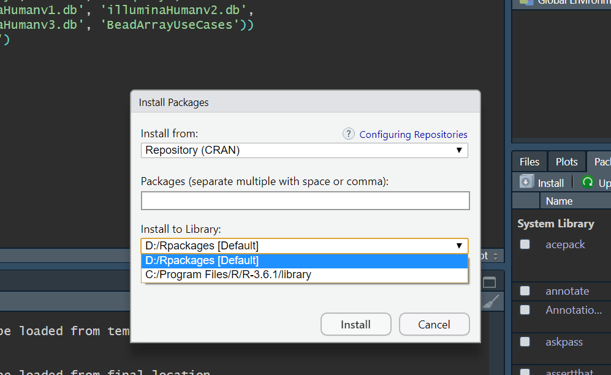

When you click package >> install, you should see a windows like this.
You can click `install to Library` to see all available path to install your packages.

After you successfully installing R-base, you will have a default R library with all R base packages:
`C:\Program Files\R\R-3.6.1\library`

If you install your R-base under C: path, you probably cannot see the path under C path. However, you may encounter problems when you 
need to update your package under that path. 

